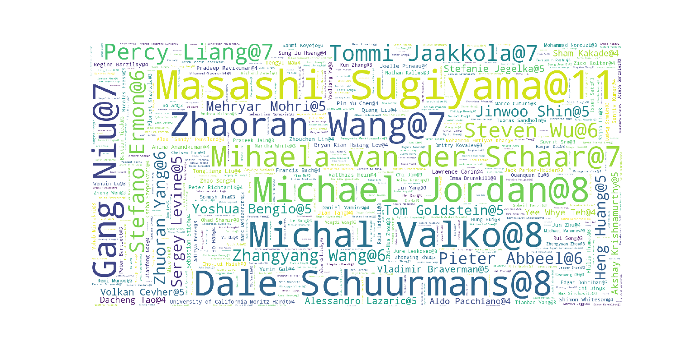
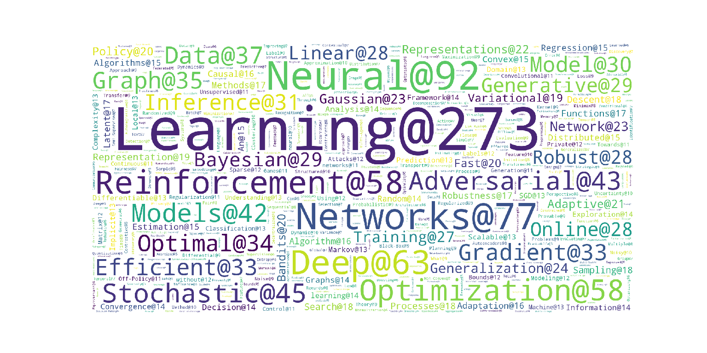
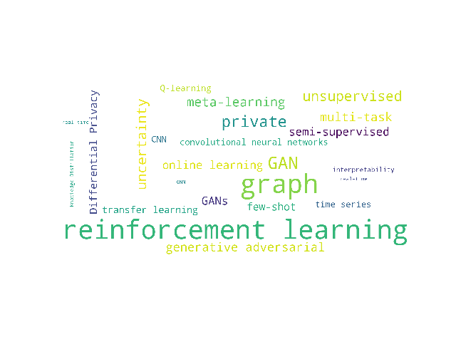
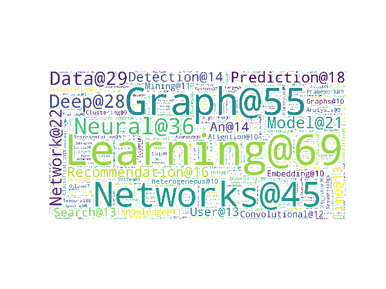
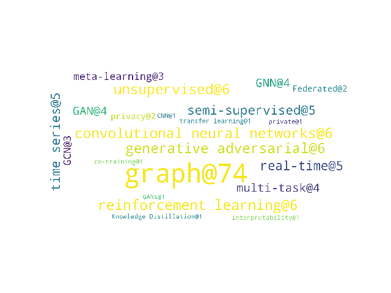

# Top AI Conferences 论文统计信息

# 声明

本文对各个AI和data science相关的顶会进行整理，主要有以下几个目的：

- 统计：给出各大会议接收论文的关键词、主题、作者信息的统计
- 归类：根据识别出的主题将各个会议的文章进行自动的归类，便于检索和阅读；

**会议类别**：

* [ICML 2020](#ICML-2020)      [ICML 2019]()
* [KDD 2020](#KDD-2020)
* [Multimedia (MM) 2020](#MM-2020)

# ICML 2020

参考：Paper Digest对ICML-2020接收论文的整理([链接](https://www.paperdigest.org/2020/07/icml-2020-highlights/))

## 对作者信息统计生成author_cloud

Top 10 authors:

|author|num_papers|University|
|:----|:----|:----|
|Masashi Sugiyama|11|University of Tokyo|
|Michael Jordan|8|UC Berkeley|
|Michal Valko|8|DeepMind & Inria & ENS|
|Dale Schuurmans|8|Google Brain & U of Alberta|
|Zhaoran Wang|7|Northwestern U|
|Gang Niu|7|RIKEN AIP|
|Mihaela van der Schaar|7|University of Cambridge|
|Percy Liang| 7|Stanford|
|Tommi Jaakkola|7|MIT|
|Steven Wu|6|U of Minnesota|

## 对关键词信息统计生成word_cloud
problem: 
- 很多专业名词(e.g., Adversarial Network, neural network)被分开成为两个词语
，不符合实际情况； 
- 大小写，单复数应该要不敏感; 

## 对论文按照主题进行统计分类

problem：
- 自动找出一堆标题、摘要中出现次数很多的主题：主题发现；（手工定义容易遗漏，需要领域知识）
- 自动将类似主题聚类合并；

To be finished...

|topic|num_papers|
|:----|:----|
|reinforcement learning|59|
|graph|58|
|GAN|17|
|private|14|
|unsupervised|11|
|uncertainty|11|
|multi-task|8|
|generative adversarial|8|
|GANs|7|
|online learning|7|
|semi-supervised|7|
|Differential Privacy|6|
|few-shot|6|
|transfer learning|5|
|Federated|5|
|Federated learning|5|
|convolutional neural networks|4|
|Q-learning|4|
|time series|4|
|CNN|4|
|generative adversarial|4|
|interpretability|2|
|Knowledge Distillation|1|
|real time|1|
|GNN|1|
|real-time|1|

# KDD 2020

**summary**:  

- Total num (RT+ADS), Research Track, and Applied Data Science (ADS) track of paper in KDD 2020 is :  **338 217 121 **; 
- Total number of submission: **2035** (the highest in history,over 13% more than the second highest one)
- Research track(long paper): 1279 submition, 216 accepted, **216 / 1279 = 16.9%**; 
- **Conference schedule**: [Click here](https://www.kdd.org/kdd2020/schedule)

## 对关键词信息统计生成word_cloud
problem: 
- 很多专业名词(e.g., Adversarial Network, neural network)被分开成为两个词语
，不符合实际情况； 
- 大小写，单复数应该要不敏感; 

## 对论文按照主题进行统计分类

problem：
- 自动找出一堆标题、摘要中出现次数很多的主题：主题发现；（手工定义容易遗漏，需要领域知识）
- 自动将类似主题聚类合并；

To be finished...

|topic|num_papers|
|:----|:----|
|graph|74|
|convolutional neural networks|6|
|unsupervised|6|
|generative adversarial|6|
|reinforcement learning|6|
|time series|5|
|semi-supervised|5|
|real-time|5|
|GAN|4|
|GNN|4|
|multi-task|4|
|GCN|3|
|meta-learning|3|
|Federated|2|
|privacy|2|
|private|1|
|interpretability|1|
|Knowledge Distillation|1|
|co-training|1|
|CNN|1|
|GANs|1|
|transfer learning|1|

